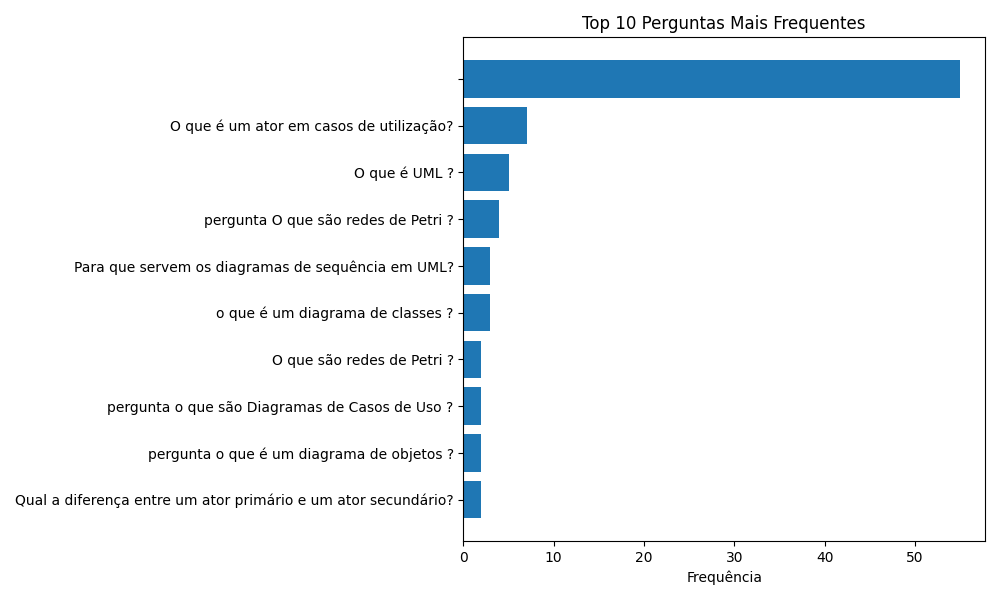

# Relatório de Respostas do Chatbot Velvet-2B

Este relatório foi gerado automaticamente com base no histórico de respostas guardado no ficheiro `velvet_respostas.json`.

## Top 10 Perguntas Mais Frequentes

| pergunta                                                      |   frequencia |
|:--------------------------------------------------------------|-------------:|
|                                                               |           55 |
| O que é um ator em casos de utilização?                       |            7 |
| O que é UML ?                                                 |            5 |
| pergunta O que são redes de Petri ?                           |            4 |
| Para que servem os diagramas de sequência em UML?             |            3 |
| o que é um diagrama de classes ?                              |            3 |
| O que são redes de Petri ?                                    |            2 |
| pergunta o que são Diagramas de Casos de Uso ?                |            2 |
| pergunta o que é um diagrama de objetos ?                     |            2 |
| Qual a diferença entre um ator primário e um ator secundário? |            2 |

## Resumo de Métricas por Pergunta

| pergunta   | valida   |   tempo_execucao |   num_documentos |   resposta_tokens | data_hora   |
|:-----------|:---------|-----------------:|-----------------:|------------------:|:------------|
|            | False    |                0 |                0 |                 0 | N/A         |
|            | False    |                0 |                0 |                 0 | N/A         |
|            | False    |                0 |                0 |                 0 | N/A         |
|            | False    |                0 |                0 |                 0 | N/A         |
|            | False    |                0 |                0 |                 0 | N/A         |
|            | False    |                0 |                0 |                 0 | N/A         |
|            | False    |                0 |                0 |                 0 | N/A         |
|            | False    |                0 |                0 |                 0 | N/A         |
|            | False    |                0 |                0 |                 0 | N/A         |
|            | False    |                0 |                0 |                 0 | N/A         |

## Respostas Inválidas Detetadas

Foram detetadas 113 respostas inválidas. Detalhes no ficheiro `respostas_invalidas.json`.
