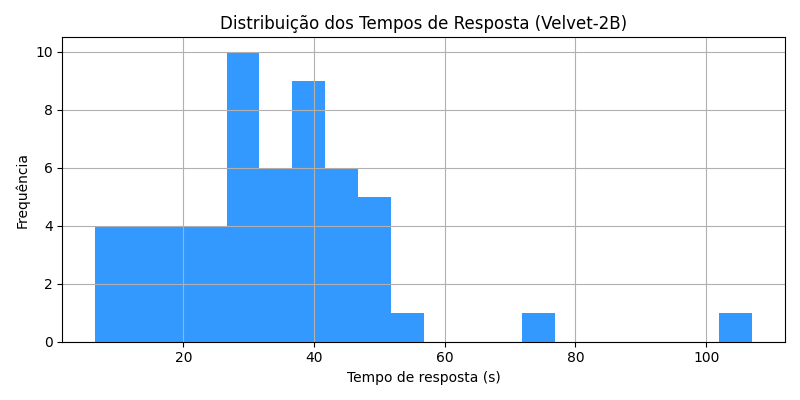
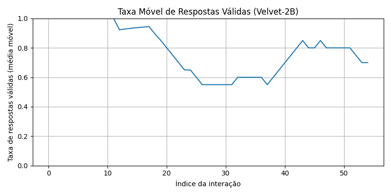

# Relatório Local de Métricas do Velvet-2B

**Total de respostas analisadas:** 55

- Tempo médio de resposta: **33.45 segundos**
- Taxa de respostas válidas: **72.7%**
- Tokens médios por resposta: **66.7**

## Distribuição dos Tempos de Resposta

## Taxa de Respostas Válidas ao Longo do Tempo

## Primeiras 10 métricas:

| data                       | pergunta                                                                             |   tempo_execucao |   prompt_tokens |   resposta_tokens |   palavras_chave_comuns | validacao_keywords   |
|:---------------------------|:-------------------------------------------------------------------------------------|-----------------:|----------------:|------------------:|------------------------:|:---------------------|
| 2025-05-02T22:59:20.780060 | o que são redes de Petri ?                                                           |            30.5  |             120 |                74 |                      14 | True                 |
| 2025-05-02T23:01:38.543068 | qual a diferença entre um diagrama de estado e um diagrama normal?                   |            29.68 |             122 |                83 |                      13 | True                 |
| 2025-05-02T23:04:23.400502 | qual a diferença entre testes de carga e testes funcionais ?                         |            20.93 |             205 |                72 |                      14 | True                 |
| 2025-05-03T00:35:25.633077 | pergunta O que são redes de Petri ?                                                  |            27.58 |             145 |                75 |                      12 | True                 |
| 2025-05-06T19:06:56.175473 | o que são diagramas de estado ?                                                      |            25.11 |             154 |                66 |                      13 | True                 |
| 2025-05-06T19:09:36.756887 | o que são diagramas de rede ?                                                        |            47.89 |             115 |                76 |                       9 | True                 |
| 2025-05-22T15:24:16.655801 | Qual é a diferença entre rede local e rede alargada, e como funcionam?               |            37    |             139 |                78 |                      12 | True                 |
| 2025-05-22T15:29:09.289945 | o que são diagramas UML ?                                                            |            32.75 |              94 |                81 |                      17 | True                 |
| 2025-05-22T15:31:42.286620 | qual a diferença entre redes de Petri modelção de dados e a modelação da estrutura ? |            41.84 |             190 |                79 |                      10 | True                 |
| 2025-05-22T15:33:51.705828 | o que são redes de Petri ?                                                           |            42.54 |             120 |                74 |                      14 | True                 |
